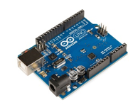

Méthodologie pour la découverte de l’électronique
-------------------------------------------------
***Rémi Sarrailh pour le Fablab de Saint Gély du Fesc Le 15 septembre 2022***

***[Si vous voulez être au courant des mises à jour, suivez-moi sur Twitter : @us1ni](https://twitter.com/us1ni)***


# Introduction
Une des manières les plus efficace pour faire découvrir l’électronique à des néophytes est de leur faire relier des composants (LED, boutons, afficheurs, capteurs…) à un microcontrôleur (un circuit intégré conçu pour régir une opération spécifique. Il comprend un processeur, une mémoire et des périphériques d’entrée et de sortie sur une seule puce)


Cela leur permet de voir rapidement ce qu’il est possible de faire, avec un microcontrôleur    
***Mais quel microcontrôleur convient le mieux pour débuter l’électronique ?***

## Choix de la carte
Habituellement, pour découvrir l’électronique, on utilise un Arduino Uno comme plateforme de prototypage (une plateforme de prototypage plus souvent appelé carte ou board est un microcontrôleur équipé d’un programmeur USB intégré et d’autres composants pour simplifier le prototypage).




Mais ces dernières années, un concurrent (Espressif) a pris le dessus sur Arduino dans la communauté des makers avec son ESP8266 puis l’ESP32 (et ses variantes).
Doté d’un processeur plus puissant, et capable de communiquer en Bluetooth LE et/ou en WiFi, l’ESP32 est devenu le standard pour les projets open source. (Bien que l’ESP8266 reste encore très utilisé malgré qu’il soit moins puissant et dépourvu du Bluetooth)


***C’est donc sur l’ESP32 que nous allons concentrer notre attention***

## Problématique
Pour autant, faire découvrir le potentiel d’un ESP32 à un public qui n’a jamais fait d’électronique ni de programmation peut s’avérer long et compliqué.   

Il faut à la fois expliquer comment relier les composants sur une breadboard (platine d’expérimentation) et comment le programmer.      

Pour garder un côté plus ludique à cette découverte, j’ai réfléchi à créer une plateforme sous la forme d’un site web qui ne se concentre que sur la partie la plus amusante : relier les composants sur une breadboard.


## Solution

Mais il ne suffit pas de relier des composants pour qu’il fonctionne, il faut aussi les programmer.   

Heureusement, aujourd’hui, il est possible grâce à l’API Web Serial  de programmer un microcontrôleur et de communiquer avec celui-ci depuis un simple câble USB et une page web sans avoir à installer le moindre logiciel.   

L'API Web Serial relie le Web et le monde physique en permettant aux sites Web de communiquer avec des périphériques série, tel que des microcontrôleurs et des imprimantes 3D : https://web.dev/serial/

Cela ouvre la possibilité de créer des applications et de les distribuer en quelques clics à n’importe qui.
J’ai créé un prototype de site web qui exploite ces possibilités avec deux objectifs :
* Permettre de tester rapidement des composants électroniques sans avoir à se demander si le code est correct et chercher comment les câbler.
* Être un outil simple et ludique pour découvrir le potentiel de l'électronique Open Hardware à un public large.


À noter : Le WebSerial ne marche pas sur Firefox, nécessite une connexion sécurisée https (ou un serveur web sur un réseau local ou directement sur l’ordinateur)   

Le WebSerial commence déjà à être utilisé par pas mal de projets, principalement pour programmer facilement des cartes (avec ESPWeb Tools)


Voici quelques exemples notables :
* WLED : Strip de LED connecté avec une interface web très complète
* Tasmota : Firmware open source pour objets connectés (principalement pour de la domotique)
* ESPEasy : Firmware open source pour objets connectés
* CanAirIO : Capteur de qualité de l’air connecté (soit en WiFi, soit en Bluetooth LE)
* Espruino IDE : Programmation JavaScript pour les cartes espruino
* Microsoft MakeCode : Programmation Scratch pour les cartes micro:bit (et autres)   

Grâce au WebSerial, on peut ainsi programmer un microcontrôleur comme on installerait une application sur son ordinateur, ouvrant la possibilité de créer des appareils qui pourront être réparés, améliorer, personnalisée et dont l’utilisateur a pleinement connaissance de ce que le code fait.

# Présentation de µsini Espress
Dans cette partie, je vais vous présenter mon application web (espress) qui a pour but tout autant de faire découvrir l’électronique que de faire découvrir les possibilités du WebSerial.   

Puis nous verrons plus en détail comment µsini Espress fonctionne et comment sont géré la création des firmwares des applications avec platformio.   

Libre à vous de réexploiter ces informations pour faire évoluer ce site, où réutiliser le code pour une autre utilisation.   

***https://usini.eu/espress***

***Note : Lors de ma présentation à la réunion du fablab de St Gely, j’ai présenté une version antérieure d’µsini espress, ici, je vais présenter la version 2.***

## Page d’accueil

Voici la page d’accueil de µsini Espress, pour le moment il y a très peu de composants / cartes disponibles.
Ils ont surtout été choisis afin de vérifier si la logique de la programmation du site est suffisamment bien pensée pour pouvoir facilement ajouter de nouveaux composants et de nouvelles cartes.


Les composants sont donc choisis pour tester plusieurs cas de figures :   
Outre les classiques LED et bouton tactile, j’ai choisi 
* Deux afficheurs qui utilisent deux protocoles de communication différente (I²C et SPI)
* Un capteur pour tester un exemple d’interaction (afficher les valeurs sur la page)
* Un DAC audio pour tester la génération de firmware (micrologiciel) avec une partition LittleFS (pour enregistrer un MP3 directement dans la mémoire du microcontrôleur)

## Liste des composants


## Vue composant (sans interactivité)
Chaque composant, à un diagramme de connexion sur breadboard (qui diffère selon la carte choisie) et un bouton pour choisir l’application.


Chaque composant peut avoir de 1 à plusieurs applications, il y a toujours une application de test qui est le plus souvent l’exemple fourni avec la bibliothèque qui permet de programmer le composant.   

Pour le moment, les applications sont assez basiques, ultérieurement l’emphase sera mise à trouver des applications plus ludiques.   


Une fois l’application sélectionnée, c’est ESP-Web-Tools qui prend la relève, ESP-Web-Tools permet de programmer notre carte (à l’aide d’un programme préalablement compilé, il n’est pas possible de le modifier directement bien qu’il soit possible de rajouter la possibilité de configurer ce que fait le code directement dans la page web)


## Vue composant (avec interactivité)

La vue composant peut aussi avoir une partie interactive, une fois programmer, il suffit de se connecter à la carte afin de recevoir (ou envoyer) des données depuis l’USB.


Dans cet exemple, nous avons relié un Lolin D32 à un capteur BME280 (Température / Humidité / Pression atmosphérique).
Une fois connecté le capteur peut transmettre par USB ces informations sous la forme de gauge graduée, ainsi que de prévenir l’utilisateur si le capteur n’est pas correctement connecté.

Comme dit précédemment, cela permettrait aussi d’envoyer des ordres à notre microcontrôleur (par exemple allumer/éteindre un relai), de configurer le WiFi / sur quel serveur se connecter, etc…
Vous pouvez d’ailleurs trouver un exemple plus complet qui va dans ce sens avec un autre projet que j’ai fait M5AtomKhey.
https://usini.github.io/M5atomKhey/


## Diagrammes présents sur le site

Toutes les illustrations sur le site sont vectorielles (il s’agit d’image numérique composée d’objets géométriques individuels et de primitives géométriques).

Cela permet de pouvoir zoomer à l’infini dessus et surtout de pouvoir les réutiliser.

Tous les schémas, composants sont donc téléchargeables en deux clics puis modifiable avec des logiciels comme Inkscape ou Illustrator.


Toutes les illustrations ont été créés sous Inkscape par µsini, et sont sous licence CC-0 (Domaine Public)


Ainsi elles peuvent être réutilisées sans attribution.

## Code du site
Le code du site et des exemples sont sous licence MIT et disponible sur Github, afin que tout le monde puisse :
* Contribuer au site web
* Le télécharger, pour l’héberger sur leurs propres plateformes ou hors-ligne 


## Contribuer au projet
Si vous voulez contribuer au projet, vous êtes les bienvenus.
Vous pouvez me contacter :
* Par email sur usini.espress@gmail.com
* Sur discord : https://discord.gg/fjNQ4vVBvB
* Sur Github : https://github.com/usini/espress

# Fonctionnement de µsini Espress

L’emphase a été mise sur la simplicité du fonctionnement du site web, pas de base de données, ni de backend.
Il s’agit en effet d’un site web statique, les données nécessaires à son fonctionnement sont sous forme de fichiers JSON (à l’instar d’ESP-Web-Tools) qui sont récupérés à l’aide de l’API Fetch   

https://developer.mozilla.org/fr/docs/Web/API/Fetch_API/Using_Fetch   

Cette API permet de faire très simplement des requêtes XMLHttpRequest.   

Bien que le site est statique, il nécessite un serveur web (même très basique) car la politique de sécurité des navigateurs interdisent les requêtes fetch directement sur le disque dur.

## Langage et Framework

J’ai utilisé le framework CSS Pico.css qui permet de créer un site web responsive (avec le dark/light mode) en utilisant le moins de classes possibles (ne voir aucune en mode classless) (et n’a aucune dépendance en JavaScript)

***https://picocss.com***

Ce framework est très basique, mais amplement suffisant pour cet usage.


Le site dépend énormément de JavaScript, qui va avoir pour rôle de récupérer puis afficher à l’aide d’un système de template très simple :
* La liste des composants disponibles
* La liste des applications disponibles pour les cartes
* La liste des cartes disponibles
* Les applications interactives en HTML/JS

Le JavaScript s’occupe aussi de l’internationalisation du site, avec un système très basique.
Des bibliothèques externes sont aussi utilisées :
* esp-web-tools : https://github.com/esphome/esp-web-tools  (Programmation des ESP)
* esperial : https://github.com/usini/esperial (Communication en WebSerial simplifié)
* gauge : https://github.com/bernii/gauge.js (Système de gauge animé)
* marked : https://github.com/markedjs/marked (Conversion Markdown vers HTML)

## Structure statique du site

Cette partie est la partie qui n’a pas vocation à être modifiée pour ajouter de nouveaux contenus.
Le site est composé d’uniquement 3 pages HTML
* index.html (Liste des composants)
* c.html (Vue composants)
* about.html (Page à propos)

Auquel est adjoint un fichier JavaScript par page
* index.js (gère l’affichage des composants / des cartes)
* components.js (gère l’affichage des diagrammes / la liste des applications / la génération de la partie interactive)
* about.js (gère la transformation du fichier Markdown en texte)

Il y a 3 autres fichiers JS
* defaults.js  (intègre le fichier i18n.js pour la traduction et la sauvegarde du mode dark/light dans le localStorage)
* i18n.js (ouvre le fichier dans lang/[lang].js) et traduit les champs nécessaires (où [lang] est la langue du navigateur)
* modal.js (pour gérer l’ouverture de la modale du choix d’applications)


## Partie dynamique du site
La partie dynamique du site est regroupée dans deux dossiers :
* apps (illustration du composant / firmwares / diagramme de branchement / code HTML de la partie interactive / liste des composants / liste des applications)
* boards (illustration des cartes)

### Dossier boards
Le dossier boards comporte l’illustration des cartes disponibles et un listing sous la forme d’un fichier JSON des noms des cartes (boards.json).


### Dossier Apps
Le dossier Apps comporte les dossiers de chaque composant de la page d’accueil, le listing sous la forme JSON des composants (apps.json).


Pour chaque composant nous avons deux dossiers ainsi qu’une illustration et un listing en JSON des applications [nom_du_composant].json :
* Le dossier boards qui contient pour chaque carte, les firmwares de chaque application par carte et le diagramme de connexion
* HTML qui contient un fichier HTML/JS qui sera intégré à la vue composant pour la partie interactive


À noter que par défaut, il y a toujours une application appelée test qui n’est pas précisée dans le listing.


### Diagramme de composition de la page d'accueil


### Diagramme de composition de la page composant (BME280)


### Gestion de la traduction
La gestion des traductions est très primaire, mais fonctionnelle


Après que la page HTML est chargée, i18n.js va récupérer toutes les balises avec la classe i18n puis lire son contenu
Il va chercher si le contenu existe dans le tableau lang[] de la langue sélectionné sur le navigateur 


Afin d’éviter que les champs soient affichés avant d’être traduits, l’opacité de la page par défaut et de 0 puis une fois traduite de 1.


À noter que pour la page about.html, un fichier markdown par langue est utilisé afin de ne pas avoir à traduire l’intégralité de la page.

### Gestion des pages interactives
#### Fonctionnement
Dans l’exemple du capteur BME280, il y a une partie interactive, à chaque ouverture de la vue composant, le script components.js va en effet chercher si une page HTML/js du nom de l’application est disponible


Si c’est le cas la page HTML est intégrée dans la balise html_app puis le script JS est intégré dans la partie head du document.   

Grâce à ce système, il est possible d’ajouter un système pour communiquer avec le microcontrôleur ou simplement rajouter du texte à la page   
À noter qu’il faut relancer la commande translate_all(lang) afin de traduire le contenu de la page.    

(Il est possible de rajouter des traductions directement dans la page, même si cela présente le risque de disperser la traduction un peu partout)

#### Communication Série Web simplifiée (Esprerial.js)

Afin de simplifier, la communication série depuis JavaScript, une bibliothèque est chargée dans la vue composant : Esprerial    

La documentation et le code sont disponibles ici : https://github.com/usini/esprerial

## Gestion des firmwares

Pour chaque composant, il peut y avoir de 1 à x applications, pour x cartes.
Chaque code arduino doit donc être compilé sous la forme d’un micrologiciel (firmware) pour chaque carte, ce qui est une tâche longue et sujette à erreur et doit donc être automatisé.   
Pour programmer ces firmwares, j’ai utilisé platformio ce qui me permet d’automatiser leur génération et leur copie à l’aide d’un script python.

### Structure des dossiers de code Arduino
Les codes Arduino sont disponibles dans le dossier code, qui est similaire à la structure du dossier apps (composant / programme)


### Spécificités des cartes / microcontrôleurs 

À l’aide de directives de préprocesseur, il est possible de créer un code qui fonctionnera de manière universelle sur tous les types de cartes / microcontrôleur.   

Ainsi on peut écrire un programme qui fonctionnera pour toutes les cartes (cette méthode est très utilisée par le firmware marlin des imprimantes 3D qui utilise lui aussi platformio)

***https://github.com/MarlinFirmware/Marlin***

Ici par exemple, pour le clignotement de LED, on peut définir pour chaque carte, la broche où est reliée la LED intégrée à la carte.


Chaque partie entourée d’un #ifdef /#endif ne sera utilisé que pour la carte.

### Configuration de platformio par programmes (platformio.ini)
Pour chaque carte est défini un fichier platformio (qui sera probablement généré automatiquement ultérieurement)
#### Common
Une partie [common] définie la configuration commune à toutes les cartes :


Le framework utilisé (arduino), en effet il serait aussi possible de créer des codes à partir du langage natif de l’ESP (ESP-IDF).    

La configuration du moniteur série intégré (ces options sont nécessaires pour pouvoir entrer des commandes dans le moniteur série)    

Les bibliothèques utilisées et la version utilisée au moment de la création du code (en cas de changement cassant le code on peut ainsi rester sur une version antérieure le temps de le mettre à jour)

#### ESP8266 / ESP32
Puis une partie spécifique au microcontrôleur est défini, ici rien de bien indispensable, il s’agit de filtres pour le moniteur série qui permet d’automatiquement convertir les erreurs fatales (backtrace) dans un format lisible.


#### Spécifique à la carte


Au final on définit les paramètres de la carte, on crée un build_flag (une constante) qui va nous permettre de créer nos directives de préprocesseur utilisées.

Les build_flags sont très importants pour certains usages, comme pour la bibliothèque de gestion des afficheurs TFT (TFT_eSPI) qui permet de configurer l’afficheur


### Script de génération des firmwares
Une fois les programmes créent, il nous faut les compiler puis les copier dans le dossier apps.
Pour cela j’ai créé un script python (generate_binaries.py) qui va devoir s’occuper de gérer 4 parties
* Lancer la compilation du programme pour toutes les cartes
* Ajouter la description du programme de platformio.ini dans le manifest.json du firmware
* Dans le cas où il y aurait une partition LittleFS la générer puis utiliser le manifest.json prévu pour.
* Copier le firmware et le bootloader dans le dossier apps correspondants afin qu’il soit accessible à l’application web.


#### Compilation des programmes
Le script python va parcourir tous les dossiers et exécuter la commande pio run qui va se charger de compiler tous les programmes pour toutes les cartes précisées dans platformio.ini.

Si on voit que dans le fichier platformio.ini, une partition LittleFS est utilisé, on exécute la commande pio run –target buildfs pour la compiler.

#### Structure d’un firmware ESP32
J’ai une connaissance limitée de cette structuration, j’ai surement pris beaucoup de raccourcis dans cette explication et je peux très bien l’avoir mal comprise.

Pour les ESP32, il nous faut à minima 4 fichiers :
* bootloader_dio_40m.bin : Le First Stage Bootloader chargé de lancer le Second Stage Bootloader
* boot_app0.bin : Le Second Stage Bootloader chargé d’exécuter le programme
* partitions.bin : La table des partitions
* firmware.bin : Le programme en lui-même
* littleFS.bin : (optionnel) la partition LittleFS qui permet de stocker des fichiers

Source : https://docs.espressif.com/projects/esp-idf/en/latest/esp32/api-guides/startup.html

Les fichiers bootloaders ne sont pas intégrés dans le programme, on va les chercher directement dans le dossier .platformio.
* /packages/framework-arduinoespressif32/tools/sdk/esp32/bin/ (pour le first stage)
* /packages/framework-arduinoespressif32/tools/partitions/boot_app0.bin (pour le second stage)

#### Le fichier manifest.json
Il faut expliquer à ESP-Web-Tools quels fichiers seront téléversés et leur position dans la mémoire (offset), pour cela il se sert du fichier manifest.json


À noter le champ name qui est généré automatiquement par le script Python à partir de la description du fichier platformio.ini

Heureusement, ce fichier n’est pas voué à vraiment changer si on reste sur le même type de microcontrôleur (à l’exception de si on utilise ou pas une partition LittleFS pour stocker des fichiers)

Pour autant, il est utile de savoir comment récupérer la position des offsets et l’emplacement de chaque fichier binaire.

#### Position des offsets / Emplacement des fichiers binaires
Pour savoir la position des offsets, il va nous falloir téléverser notre programme avec pio (platformio en ligne de commande) avec l’option verbose

```
pio run –target upload -e lolin_d32 –verbose
```

Juste avant l’upload s’affiche la commande exécutée par platformio pour téléverser le programme
```
C:\tools\Anaconda3\python.exe" 
"C:\Users\remi\.platformio\packages\tool-esptoolpy\esptool.py" 
--chip esp32 --port "COM24" --baud 460800 --before
default_reset --after hard_reset write_flash -z 
--flash_mode dio --flash_freq 40m --flash_size 4MB 0x1000 
C:\Users\remi\.platformio\packages\framework-arduinoespressif32
\tools\sdk\esp32\bin\bootloader_dio_40m.bin
0x8000 C:\Users\remi\OneDrive\espressv2\code\bme280\bme280_test
\.pio\build\lolin_d32\partitions.bin 
0xe000 C:\Users\remi\.platformio\packages\framework-arduinoespressif32
\tools\partitions\boot_app0.bin 
0x10000 .pio\build\lolin_d32\firmware.bin
```

Si on extrait la fin de la commande, on obtient l’ensemble des fichiers téléversés avec leur offset :
* 0x1000 C:\Users\remi\.platformio\packages\framework-arduinoespressif32\tools\sdk\esp32\bin\bootloader_dio_40m.bin 
* 0x8000 C:\Users\remi\OneDrive\espressv2\code\bme280\bme280_test\.pio\build\lolin_d32\partitions.bin 
* 0xe000 C:\Users\remi\.platformio\packages\framework-arduinoespressif32\tools\partitions\boot_app0.bin 
* 0x10000 .pio\build\lolin_d32\firmware.bin

Vous notez que les nombres sont différents de ceux présents dans le manifest.json, c’est parce qu’ils sont représentés par des valeurs hexadécimales alors que dans le manifest.json il sont dans des valeurs décimales.

Il nous faut donc les convertir (https://www.rapidtables.com/convert/number/hex-to-decimal.html)


Vous n’aurez pas pour autant la position de la partition de données LittleFS par ce moyen, pour cela il faut exécuter la commande
```
pio run --target uploadfs -e lolin_d32 –verbose
```

On obtient alors la fameuse commande d’esptool.py
```
"C:\tools\Anaconda3\python.exe" 
"C:\Users\remi\.platformio\packages\tool-esptoolpy\esptool.py"
 --chip esp32 --port "COM24" --baud 460800 
 --before default_reset --after hard_reset write_flash 
 -z --flash_mode dio --flash_size detect 2686976 
 .pio\build\lolin_d32\littlefs.bin
```

On peut alors observer un manque de consistances sur la valeur qui elle est directement en décimale
(tant mieux pour notre cas)

### Copie des données
Il ne nous reste plus qu’à copier les fichiers correspondants dans le dossier apps.   
Une fois terminé le dossier du cache de la compilation et des bibliothèques .pio est supprimé, en effet ces dossiers peuvent rapidement prendre beaucoup d’espaces, et nous ne voulons pas les copier sur notre serveur web.

L’ensemble du site étant aussi sauvegardés sur github, un fichier .gitignore a pour ordre d’ignorer les dossiers .pio et les fichiers binaires.

Une version avec les fichiers binaires est disponible dans les releases.
